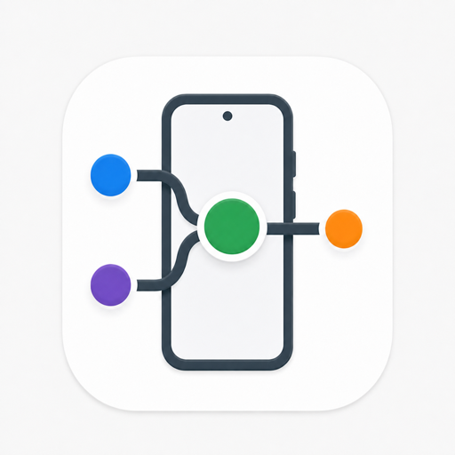
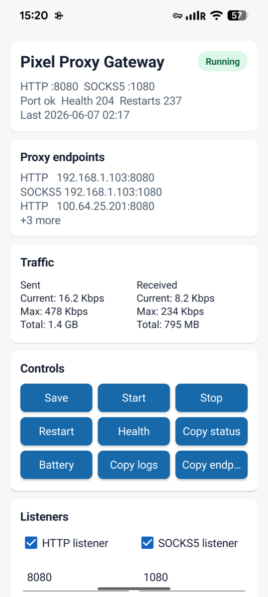
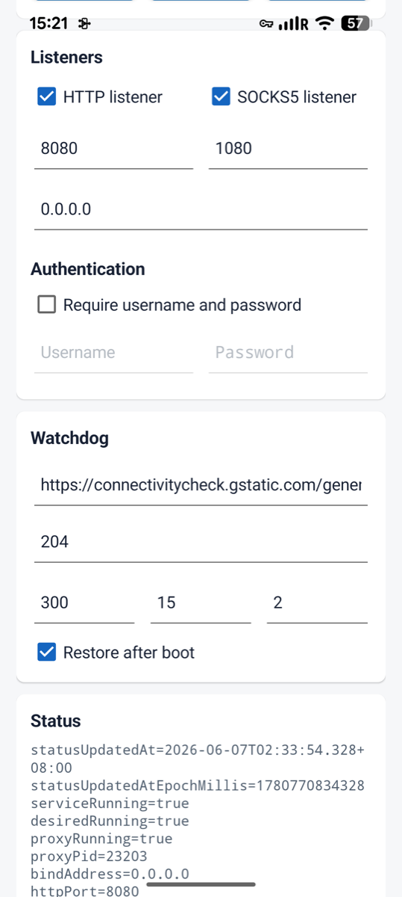
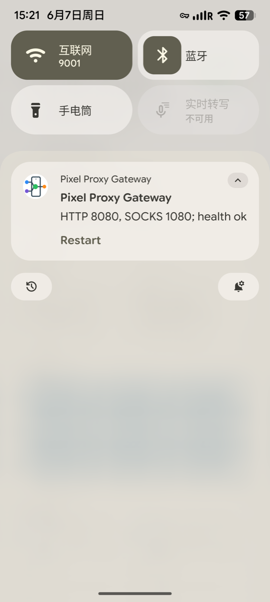

<p align="center">
  
</p>

<h1 align="center">Pixel Proxy Gateway</h1>

<p align="center">
  Turn an Android phone with an active VPN into a stable, observable LAN HTTP/SOCKS proxy gateway.
</p>

<p align="center">
  <a href="README.md">中文</a> ·
  <strong>English</strong> ·
  <a href="https://github.com/YTwsy/pixel-proxy-gateway">Homepage</a> ·
  <a href="https://github.com/YTwsy/pixel-proxy-gateway/releases/latest">Download APK</a> ·
  <a href="docs/adb.md">ADB Guide</a> ·
  <a href="https://github.com/YTwsy/pixel-proxy-gateway/issues">Issues</a>
</p>

<p align="center">
  
  
  
  
</p>

## Screenshots

<table align="center">
  <tr>
    <td align="center" width="240">
      
      <br><strong>Main Screen</strong>
    </td>
    <td align="center" width="240">
      
      <br><strong>Settings And Status</strong>
    </td>
    <td align="center" width="240">
      
      <br><strong>Notification Restart</strong>
    </td>
  </tr>
</table>

## Overview

Pixel Proxy Gateway is a single sideloaded Android app for turning an Android phone running a VPN, such as the built-in Google VPN on Pixel devices or Clash Meta, into a supervised LAN HTTP/SOCKS proxy endpoint.

The app intentionally does not implement Android `VpnService`; the phone-side VPN keeps the system VPN slot. Pixel Proxy Gateway runs as a normal Android app: it listens on proxy ports and makes outbound connections from the app process on the phone.

## Why This Project

- **GOST-powered:** the proxy engine is a pinned, source-built GOST binary packaged with the APK and verified before launch.
- **Built for long-running stability:** the app includes a foreground service, wake lock, process supervisor, port watchdog, request watchdog, rotating logs, boot/upgrade restore, and ADB diagnostics.
- **Stable Every Proxy alternative:** for always-on LAN proxy gateway use, it is designed to be more stable and diagnosable than lightweight proxy-sharing apps such as Every Proxy, while remaining open-source, free, and ad-free.
- **Operationally visible:** status, logs, health checks, listener state, and recovery behavior are exposed for troubleshooting instead of being hidden behind a minimal UI.

## Classic Use Case

A common topology is to use the Android phone as the upstream VPN egress. Other devices can point directly to the phone's proxy ports. If split routing is needed, a computer can sit in the middle as the LAN policy router, using `mihomo` rules or PAC.

**Phone A, usually a Pixel or another Android phone:**

- A phone-side VPN is enabled, such as Clash Meta or the built-in Google VPN on supported Pixel devices.
- Pixel Proxy Gateway opens HTTP and SOCKS ports for LAN access.

**Computer B:**

- `mihomo` runs with `mixed-port` and `allow-lan`.
- Phone A's Pixel Proxy Gateway endpoint is configured as an outbound proxy, for example `phoneA`.
- Rules send overseas or selected domains to `phoneA`.
- Domestic, LAN, and private ranges stay `DIRECT`.
- A PAC file can also be used when that is a better fit for the client side.

**Other devices:**

- Their proxy or PAC settings can point to Computer B.
- In simpler setups, they can point directly to Phone A's Pixel Proxy Gateway ports.

On supported Google Pixel devices and account environments, the built-in Google VPN can be used as the phone-side upstream path. Initial activation or re-verification may still need a network path that can complete Google's service verification; mobile data, eSIM, or another already trusted network path is often the least fussy way to complete that first handshake. After that, this project only exposes the phone's app-level proxy endpoint and does not replace or implement the VPN itself.

## Related Use Cases And Search Keywords

Pixel Proxy Gateway is relevant to: Android HTTP proxy, Android SOCKS5 proxy, phone as proxy gateway, Android VPN to LAN proxy, Pixel Google VPN proxy, Clash Meta proxy sharing, GOST Android proxy, Every Proxy alternative, open-source ad-free Android proxy, mihomo upstream proxy, LAN proxy sharing, PAC proxy gateway, phone VPN to LAN proxy, and supervised mobile proxy endpoint.

## Defaults

| Item | Value |
| --- | --- |
| Package | `com.wsy.pixelproxygateway` |
| HTTP | `0.0.0.0:8080` |
| SOCKS5 | `0.0.0.0:1080` |
| Authentication | Supported, disabled by default |
| Health check | `https://connectivitycheck.gstatic.com/generate_204` |
| GOST tag | `v3.2.6` |
| GOST commit | `340ba32ef0bebc7293908007cc423dd5f33dd88c` |

## Stability V1

The first usable version includes the stability layer directly:

- Foreground service with `specialUse` declaration and persistent notification.
- Wake lock while the proxy is enabled.
- GOST process supervisor with automatic restart and backoff.
- Port watchdog for HTTP/SOCKS listeners.
- Request watchdog through the local proxy with consecutive-failure threshold.
- Runtime status freshness timestamps with Pixel-clock stale-status checks in ADB tooling.
- Rotating app and GOST logs.
- Crash, post-unlock boot, and APK-replace restore from persisted config.
- ADB control and status export via `dumpsys` and content provider.

## Build GOST

The APK expects the pinned GOST executable to be packaged as an extracted native library:

```text
app/src/main/jniLibs/arm64-v8a/libgost.so
```

Build it from source:

```sh
tools/build-gost-android-arm64.sh
```

This requires `go` and network access for the first source checkout. The script writes:

- `app/src/main/jniLibs/arm64-v8a/libgost.so`
- `app/src/main/assets/gost/android-arm64/gost.sha256`
- `app/src/main/assets/gost/android-arm64/gost.tag`
- `app/src/main/assets/gost/android-arm64/gost.commit`

The build script pins both the stable tag and the expected commit. If `v3.2.6` ever resolves to a different commit, the script refuses to build.

Verify the current local source checkout, pre-APK binary, and metadata without rebuilding:

```sh
scripts/verify_gost_provenance.sh
```

The app executes GOST from Android's `nativeLibraryDir`, not from writable app data. This matters on Android 10+ because target API 29+ apps cannot directly execute files from their writable app home directory. The app verifies `gost.sha256` before starting the native binary.

## Build APK

Build the debug APK:

```sh
./gradlew :app:assembleDebug
```

Current debug APK path:

```text
app/build/outputs/apk/debug/app-debug.apk
```

Verify APK packaging and embedded GOST provenance:

```sh
scripts/verify_apk.sh
```

`verify_apk.sh` requires Android `aapt` by default so the APK package metadata and stability-critical manifest entries are actually checked. Set `ALLOW_MISSING_AAPT=true` only when you deliberately want a lightweight asset/provenance check.

Run the full host-side preflight bundle before attaching the Pixel:

```sh
scripts/host_preflight.sh
```

This writes `reports/host-preflight-*` with shell syntax checks, status parser self-test, ADB start guard self-test, LAN smoke strict-assertion self-test, Gradle build/lint/unit-test, APK packaging plus stability-critical manifest checks, GOST provenance, ADB device status, and a short device-validation checklist.

## Release APK

GitHub Actions builds a signed APK when a `v*` tag is pushed, then uploads the APK and SHA256 file to the GitHub Release.

Before the first release, generate a long-lived release signing key locally:

```sh
keytool -genkeypair -v \
  -keystore release.jks \
  -alias pixel-proxy-gateway \
  -keyalg RSA \
  -keysize 4096 \
  -validity 10000
```

Do not commit `release.jks`. Convert it to one-line base64, then paste it into the GitHub repository under `Settings` -> `Secrets and variables` -> `Actions`:

```sh
base64 -i release.jks | tr -d '\n' | pbcopy
```

Add these repository secrets:

- `ANDROID_KEYSTORE_BASE64`: the base64 value copied above
- `ANDROID_KEYSTORE_PASSWORD`: keystore password
- `ANDROID_KEY_ALIAS`: for example `pixel-proxy-gateway`
- `ANDROID_KEY_PASSWORD`: key password; leave it empty when it matches the keystore password

To publish a new version, first update `versionName` and `versionCode` in `app/build.gradle`, then push a tag:

```sh
git tag -a v1.0 -m "Pixel Proxy Gateway v1.0"
git push origin v1.0
```

After Actions completes, the Release page will include:

```text
pixel-proxy-gateway-v1.0.apk
pixel-proxy-gateway-v1.0.apk.sha256
```

## Install And Control

Install and start:

```sh
scripts/adb_install_debug.sh
scripts/adb_bootstrap.sh
scripts/adb_start.sh
```

One-shot device-side verification after connecting the Pixel:

```sh
scripts/adb_verify_device.sh
```

End-to-end acceptance check:

```sh
scripts/acceptance_check.sh
```

Verify in-app restart recovery by killing the GOST child process:

```sh
scripts/adb_fault_inject.sh
```

Override ports from ADB:

```sh
HTTP_PORT=18080 SOCKS_PORT=11080 BIND_ADDRESS=0.0.0.0 scripts/adb_start.sh
```

Enable auth from ADB:

```sh
AUTH_ENABLED=true USERNAME=myuser PASSWORD=mypass scripts/adb_start.sh
```

Status:

```sh
scripts/adb_status.sh
```

Collect a full diagnostic bundle if a device-side check fails:

```sh
scripts/adb_collect_diagnostics.sh
```

LAN/proxy egress smoke test from the Mac or another LAN client:

```sh
PIXEL_IP=<pixel-lan-ip> scripts/lan_smoke.sh
```

Make the egress proof strict when you know the expected Google VPN exit IP:

```sh
EXPECTED_PROXY_IP=<google-vpn-exit-ip> PIXEL_IP=<pixel-lan-ip> scripts/lan_smoke.sh
```

When the Mac is not expected to share the same exit, `REQUIRE_PROXY_DIFF_FROM_DIRECT=true` also fails the smoke test if the proxy public IP equals the direct public IP.

Stop or restart:

```sh
scripts/adb_stop.sh
scripts/adb_restart.sh
```

## Real-Device Validation

Google VPN routing and overnight stability must be validated on the Pixel:

1. Run `scripts/host_preflight.sh`.
2. Connect the Pixel, allow USB debugging, and run `scripts/acceptance_check.sh`.
3. Open Android battery settings and set Pixel Proxy Gateway to Unrestricted if the script warns about battery optimization.
4. Confirm the LAN smoke step reports proxy public IPs matching the expected Google VPN exit, or set `EXPECTED_PROXY_IP=<google-vpn-exit-ip>` to make the check fail automatically on mismatch.
5. From a LAN client, use `http://<pixel-ip>:8080` or `socks5h://<pixel-ip>:1080`.
6. Lock the phone and keep it charging overnight.
7. Run `scripts/adb_status.sh` and inspect restart counts, failures, and logs.
8. If anything is unclear, run `scripts/adb_collect_diagnostics.sh` and inspect the generated `reports/diagnostics-*` directory.

`acceptance_check.sh` runs APK packaging verification, ADB install/start verification, GOST process fault injection, and LAN smoke in one timestamped report under `reports/acceptance-*`. Set `RUN_LAN_SMOKE=false` to skip LAN egress during a USB-only check, `RUN_SUPERVISOR_SMOKE=true` to add a short ADB supervisor smoke run, or `RUN_REBOOT_RESTORE_CHECK=true` to include the opt-in phone reboot restore check.

If a device-side acceptance step fails, the script automatically writes a diagnostics bundle next to the step logs unless `COLLECT_DIAGNOSTICS_ON_FAILURE=false` is set.

The acceptance flow also reinstalls the APK once to verify `MY_PACKAGE_REPLACED` restore from persisted config. Set `RUN_RESTORE_CHECK=false` to skip that upgrade-restore check. Full device reboot restore is intentionally treated as post-unlock `BOOT_COMPLETED`, because this app stores its configuration in normal credential-protected app storage rather than Direct Boot storage. Run `scripts/adb_reboot_restore_check.sh` when you want to prove that path explicitly.

## Overnight Runs

For a scripted overnight run while the Pixel stays connected to ADB:

```sh
DURATION_SECONDS=28800 INTERVAL_SECONDS=300 PIXEL_IP=<pixel-ip> scripts/stability_monitor.sh
```

This writes timestamped samples under `reports/` with ADB status, listener state, GOST pid, and optional LAN smoke results. The summary includes `statusAgeSeconds`; samples whose status is stale or unreadable are marked with `adb_exit=1`.

For an ADB-connected overnight run with last-resort recovery if the service stops reporting healthy state:

```sh
DURATION_SECONDS=28800 CHECK_INTERVAL_SECONDS=60 PIXEL_IP=<pixel-ip> scripts/adb_supervise.sh
```

This app can self-recover from process, port, and request failures. `adb_supervise.sh` is deliberately outside the app and should be treated as the last-resort recovery layer for Android service state, background policy, or Google VPN/radio states that the in-app GOST watchdog cannot repair by itself. The supervisor also treats stale status older than `STATUS_MAX_AGE_SECONDS` (default `120`) as unhealthy before recovery counting.
